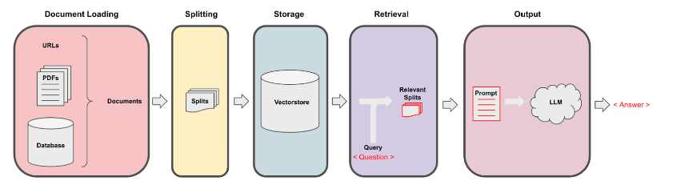
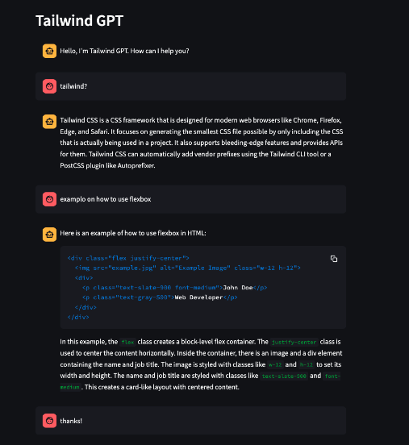

# Tailwind Expert - RAG for LLMs

## Introduction

This repository contains the code and documentation for a project related to Tailwind CSS, specifically implementing a conversational agent (chatbot) powered by Large Language Models (LLMs) and Retrieval-Augmented Generation (RAG).

RAG (Retrieval-Augmented Generation) helps address two major issues faced by LLMs (Large Language Models). On one hand, it tackles the lack of sources when answering questions, and on the other, it deals with information becoming outdated. This framework enables LLMs to access the latest information, whether from a database, an internet search on relevant sites, or other sources, and allows them to reference their responses, providing significant added value for users [4]. It particularly excels when focused on knowledge-intensive tasks.

Therefore, the focus of this work lies in utilizing RAG (Retrieval-Augmented Generation) alongside LLMs as an added value, rather than relying on LLMs alone. This will be demonstrated through a specific use case: a generative agent knowledgeable in tailwind technology. The step-by-step process for applying this framework to an LLM will be explained, and various tests and experiments will be conducted to measure the performance of different tools within the technologies used, which will be described later in the paper.

## Project Overview

The project focuses on enhancing the capabilities of LLMs, like ChatGPT, in addressing questions related to Tailwind CSS. It incorporates Retrieval-Augmented Generation (RAG) to improve sourcing and accuracy of responses.

## Features

- **Retrieval-Augmented Generation (RAG):** Utilizes RAG to enhance LLM responses by providing access to the latest information from various sources.

- **Tailwind Expert Chatbot:** Implements a chatbot specialized in answering technical questions about Tailwind CSS.

## Architecture

The project architecture includes two main modules:

1. **Indexation:** Involves obtaining and indexing relevant information.
2. **Retrieval + Generation:** This stage queries the indexed data and calls the LLM to provide the final response.


Source: Langchain

## Technologies Used

- **LLM:** OpenAI: gpt-3.5-turbo
- **Retrieval Framework:** RAG
- **Database:** [Pinecone](https://www.pinecone.io/)
- **Framework:** [LlamaIndex](https://www.llamaindex.ai/)

## Getting Started

Follow these steps to set up and run the project on your local machine:

1. Clone the repository:
   ```bash
   git clone https://github.com/figlesias221/tailwind-gpt.git
   ```

## Demo



## Contributors

<!-- ALL-CONTRIBUTORS-LIST:START - Do not remove or modify this section -->
<!-- prettier-ignore-start -->
<!-- markdownlint-disable -->
<table>
  <tr>
    <td align="center"><br /><sub><b>Federico Iglesias</b></sub></a><br /><a href="https://github.com/figlesias221/tailwind-gpt/commits?author=figlesias221" title="Code">💻</a></td>
    <td align="center"><br /><sub><b>Francisco Rossi</b></sub></a><br /><a href="https://github.com/figlesias221/tailwind-gpt/commits?author=FranRossi" title="Code">💻</a></td>
        <td align="center"><br /><sub><b>Francisco Decurnex</b></sub></a></td>

  </tr>
